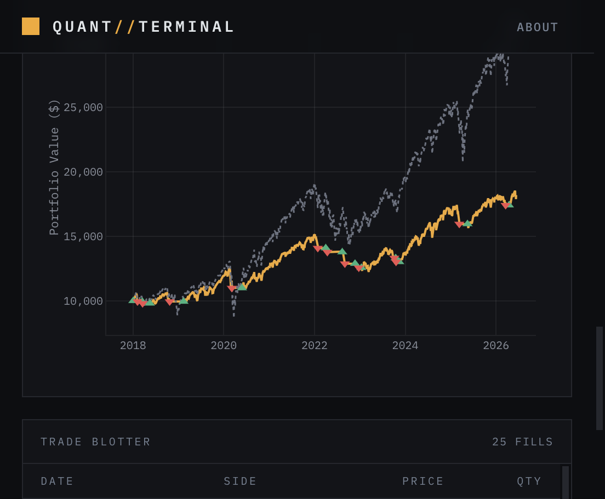

# Multi-Strategy Quantitative Trading Dashboard

A quantitative backtesting dashboard with a FastAPI backend and a Next.js
frontend. It supports five trading strategies (EMA Crossover, RSI Mean
Reversion, SMA Crossover, Bollinger Breakout, Momentum) with performance
analytics (CAGR, Sharpe, max drawdown, win rate), realistic fees/slippage,
optional volatility targeting, and a buy-and-hold benchmark. Additional
analytics (Monte Carlo, rolling metrics, parameter sweep, CSV export) are
available through the API.



## Architecture

This is a `turbo` monorepo:

```
ema-sharpe-dashboard/
  apps/
    api/                  # FastAPI backend (Python 3.11)
      main.py
      tests/
      requirements.txt
      requirements-dev.txt
      Dockerfile
    web/                  # Next.js frontend
      src/
      package.json
      Dockerfile
  packages/
    types/                # Shared TypeScript types
  scripts/                # Local dev helpers
  .github/workflows/      # CI + deploy
  Dockerfile              # Backend image (builds apps/api) used by deploy
  package.json
  turbo.json
```

The deployed Cloud Run service is the backend API (JSON only). The frontend is
a separate Next.js app (deploy to Vercel or its own container).

## How it runs: two processes

This app runs as two independent servers, and both must be running:

- Backend API: FastAPI on port 8080
- Frontend: Next.js on port 3000

The frontend calls the API at `NEXT_PUBLIC_API_URL` (default
`http://localhost:8080`). If the API is not up, the UI shows a `Failed to fetch`
error when you run a backtest.

## Quick Start

### Prerequisites
- Python 3.11+
- Node.js 18+

### Option A: one command (recommended)

This starts both servers together. Create the Python virtualenv once, then use
the root `dev` script.

```bash
# 1. one-time backend setup
cd apps/api
python -m venv .venv
source .venv/bin/activate            # Windows: .venv\Scripts\activate
pip install -r requirements.txt
cd ../..

# 2. one-time frontend setup
npm install
echo "NEXT_PUBLIC_API_URL=http://localhost:8080" > apps/web/.env.local

# 3. start API (8080) and web (3000) together
npm run dev
```

The `dev` script uses `concurrently` to run both processes with labeled,
color-coded output (`api` and `web`). The API launcher
(`scripts/dev-api.sh`) prefers `apps/api/.venv` and falls back to system
`python3`. Override the API port with `API_PORT=9000 npm run dev`.

To run a single side: `npm run dev:api` or `npm run dev:web`.

### Option B: two terminals

Terminal 1 (backend):

```bash
cd apps/api
source .venv/bin/activate
python -m uvicorn main:app --reload --port 8080
```

Terminal 2 (frontend):

```bash
npm run dev:web      # or: cd apps/web && npm run dev
```

- Frontend: http://localhost:3000
- API base: http://localhost:8080
- Interactive docs: http://localhost:8080/docs
- Sanity check: `curl http://localhost:8080/health` returns
  `{"status":"healthy",...}`

### Troubleshooting

- `Failed to fetch` when running a backtest: the backend is not running or is on
  a different port. Start the API and confirm `/health` responds, and that
  `NEXT_PUBLIC_API_URL` matches the API's port.
- `Data unavailable for <ticker>`: live market data comes from `yfinance`, which
  depends on Yahoo's (unofficial) endpoints and can break when they change. Make
  sure you are on the pinned version (`pip install -r requirements.txt`), then
  upgrade if needed (`pip install -U yfinance`) and retry with a broader date
  range or a liquid ticker (for example `SPY`). The API also caches successful
  responses on disk and serves stale data as a fallback when the upstream
  provider is down.

### Docker

```bash
# Backend (built from repo root via the root Dockerfile)
docker build -t ema-sharpe-api .
docker run -p 8080:8080 ema-sharpe-api

# Frontend
docker build -t ema-sharpe-web apps/web
docker run -p 3000:3000 -e NEXT_PUBLIC_API_URL=http://localhost:8080 ema-sharpe-web
```

## Configuration (environment variables)

### Backend (apps/api)
- `ALLOWED_ORIGINS`: comma-separated CORS origins, or `*` to allow any.
  Default `*` for local development. Set to your domain(s) in production.
- `API_KEY`: optional shared secret. When set, every endpoint except the public
  paths (`/health`, `/docs`, `/redoc`, `/openapi.json`) requires a matching
  `X-API-Key` header.
- `DATA_CACHE_DIR`: directory for the on-disk market-data cache. Defaults to a
  temp directory.
- `DATA_CACHE_TTL`: cache freshness in seconds (default `3600`). Set `0` to
  disable using the cache as a fresh source (stale fallback still applies on
  fetch failures).

### Frontend (apps/web)
- `NEXT_PUBLIC_API_URL`: base URL of the backend API
  (default `http://localhost:8080`).
- `NEXT_PUBLIC_API_KEY`: optional. When the backend has `API_KEY` set, provide
  the same value here so the frontend sends the `X-API-Key` header.

## Features

### Trading strategies (backend)
- EMA Crossover: long when the fast EMA is above the slow EMA
- RSI Mean Reversion: long on oversold, flat on overbought (configurable)
- SMA Crossover: simple moving-average crossover
- Bollinger Breakout: volatility-based breakout signals
- Momentum: trend-following lookback momentum

### Analytics
- Performance metrics: CAGR, Sharpe, max drawdown, win rate, volatility,
  average trade return, total trades
- Benchmark comparison: strategy vs. buy-and-hold equity curve
- Realistic costs: configurable fees and slippage
- Volatility targeting: optional position sizing toward a target vol
- Monte Carlo (`/api/monte-carlo`): bootstrap of terminal equity
- Rolling metrics (`/api/rolling`): rolling Sharpe / CAGR / drawdown
- Parameter sweep (`/api/parameter-sweep`): strategy-aware grid over the two
  primary parameters of the selected strategy, returning a Sharpe heatmap
- CSV export (`/api/export.csv`): equity curve as CSV

### Frontend (Next.js)
A dark, institutional "quant terminal" interface (IBM Plex Sans/Mono, amber
signal accent, semantic green/red for P&L):
- Sticky control rail with a strategy selector and parameter inputs specific to
  each strategy
- Dense metric board (CAGR, Sharpe, max drawdown, win rate, total trades,
  average trade return, volatility) with tabular figures
- Interactive equity curve (Plotly) with buy-and-hold overlay and trade markers
- Trade blotter table
- Parameter persistence via local storage

### Production features
- Live data via `yfinance` with on-disk caching and stale fallback
- Rate limiting: 60 requests/min per IP (in-memory, fixed window)
- Input validation: Pydantic models, ticker sanitization, date-range checks
- Configurable CORS and optional API-key authentication

## API Endpoints

- `GET /health`: health check (`{"status": "healthy", "timestamp": "..."}`)
- `GET /api/strategies`: list available strategies and their parameters
- `POST /backtest` and `POST /api/backtest`: run a backtest
- `POST /api/monte-carlo`: bootstrap Monte Carlo of terminal equity
- `POST /api/rolling`: rolling Sharpe / CAGR / drawdown
- `POST /api/benchmarks`: strategy vs. buy-and-hold summary
- `POST /api/parameter-sweep`: strategy-aware parameter sweep (Sharpe heatmap)
- `POST /api/export.csv`: equity curve as CSV

## Testing

### Backend (pytest)

API tests run with pytest and enforce a coverage floor (80% minimum gate
configured in `pytest.ini`).

```bash
cd apps/api
source .venv/bin/activate
pip install -r requirements-dev.txt
python -m pytest                      # coverage + term/html/xml reports
open htmlcov/index.html               # view HTML coverage report
```

### Frontend (Vitest)

Component and library tests run with Vitest and Testing Library.

```bash
# from the repo root
npm run test --workspace web          # single run
npm run test:watch --workspace web    # watch mode
```

### All checks

```bash
# from the repo root
npx turbo run lint typecheck test build
```

### Code quality
- Linting: `next lint` for the web app
- Type safety: full type hints on the API; strict TypeScript on the web
- Docstrings: documented functions across the API

## Deployment

See [DEPLOYMENT.md](DEPLOYMENT.md). The backend deploys to Google Cloud Run via
`.github/workflows/deploy.yml` (builds the root `Dockerfile`, which packages
`apps/api`). The frontend can be deployed to Vercel or as its own container from
`apps/web/Dockerfile`. Set `NEXT_PUBLIC_API_URL` to the API URL.

## Security

- Input validation: tickers restricted to alphanumeric + dots; date ranges
  validated; all parameters validated via Pydantic.
- Rate limiting: 60 requests/min per IP.
- CORS: configurable via `ALLOWED_ORIGINS`. Defaults to `*` for local
  development; restrict to your domain(s) in production.
- Authentication: optional shared-secret API key via `API_KEY` (sent as the
  `X-API-Key` header). Add OAuth2 / IAM for stronger production needs.
- Secrets: never commit `.env` or credentials; credential patterns are excluded
  via `.gitignore`.
- Error handling: generic client errors, detailed server-side logging, and
  appropriate status codes (400 / 429 / 500 / 503).

## License

MIT
