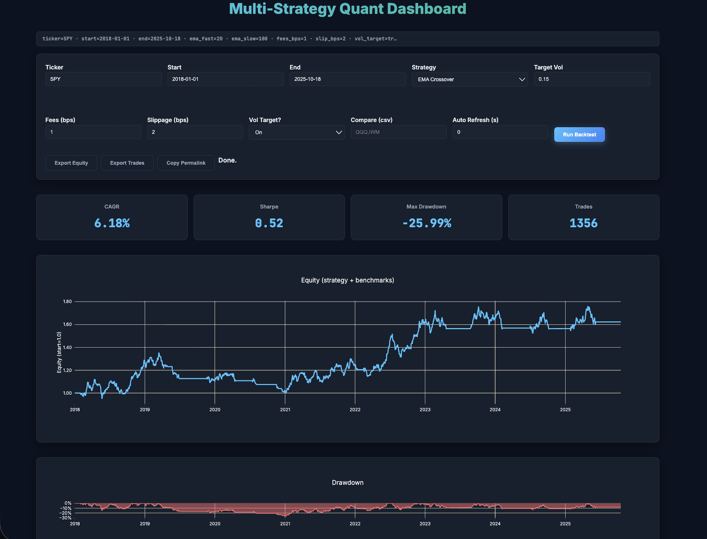

# Multi-Strategy Quantitative Trading Dashboard

A production-ready quantitative trading dashboard featuring multiple strategies (EMA Crossover, RSI Mean Reversion, SMA Crossover, Bollinger Breakout, Momentum) with comprehensive analytics including Sharpe ratio analysis, drawdown metrics, Monte Carlo simulation, and live market data integration.



*Screenshot showing the EMA Crossover strategy backtest results for SPY (2018-2025) with performance metrics, equity curve, and drawdown analysis.*

**Live Demo:** https://ema-sharpe-380303857049.us-west1.run.app/

## Features

### Multiple Trading Strategies
- **EMA Crossover**: Fast/slow EMA signals with realistic trade execution
- **RSI Mean Reversion**: Oversold/overbought signals with configurable thresholds
- **SMA Crossover**: Simple moving average crossover strategy
- **Bollinger Breakout**: Volatility-based breakout signals
- **Momentum**: Trend-following momentum strategy

### Advanced Analytics
- **Performance Metrics**: CAGR, Sharpe ratio, Max Drawdown, Win Rate
- **Monte Carlo Simulation**: Bootstrap analysis for risk assessment
- **Rolling Metrics**: Time-series analysis of Sharpe, CAGR, and drawdown
- **Benchmark Comparison**: Strategy vs buy-and-hold performance
- **Trade Analysis**: Per-trade PnL with entry/exit details

### Interactive Visualizations
- **Equity Curves**: Real-time strategy performance with benchmark overlay
- **Drawdown Analysis**: Maximum drawdown visualization
- **Exposure Charts**: Daily leverage and volatility targeting
- **Signal Tape**: Buy/sell signals with PnL tooltips
- **Sharpe Heatmap**: Parameter sweep analysis
- **Monthly Returns**: Strategy vs buy-and-hold comparison tables

### Production Features
- **Live Data Integration**: Real-time market data via yfinance
- **Rate Limiting**: API protection (60 req/min per IP)
- **CSV Export**: Download equity curves and trade data
- **Permalinks**: Shareable URLs with encoded parameters
- **Strategy Leaderboard**: Track top-performing configurations
- **Live Tracking**: Subscribe to strategy performance updates

## Quick Start

### Local Development

```bash
# Clone the repository
git clone <your-repo-url>
cd ema-sharpe-one

# Create virtual environment
python -m venv .venv
source .venv/bin/activate  # On Windows: .venv\Scripts\activate

# Install dependencies
pip install -r requirements.txt

# Run locally
uvicorn main:app --reload
```

Access at: http://127.0.0.1:8000

### Docker

```bash
# Build the container
docker build -t ema-sharpe .

# Run the container
docker run -p 8080:8080 ema-sharpe
```

### Manual Deployment

```bash
# Set your project ID
export PROJECT_ID=your-project-id
export REGION=us-central1

# Authenticate and configure
gcloud auth login
gcloud config set project "$PROJECT_ID"
gcloud config set run/region "$REGION"

# Enable required services
gcloud services enable run.googleapis.com cloudbuild.googleapis.com artifactregistry.googleapis.com

# Build and push image
gcloud builds submit --tag gcr.io/$PROJECT_ID/ema-sharpe

# Deploy to Cloud Run
gcloud run deploy ema-sharpe \
  --image gcr.io/$PROJECT_ID/ema-sharpe \
  --platform managed \
  --allow-unauthenticated \
  --port 8080 \
  --memory 1Gi \
  --cpu 1 \
  --max-instances 10
```

### Custom Domain (Optional)

```bash
# Set your custom domain
export CUSTOM_DOMAIN=ema-sharpe.yourname.dev

# Create domain mapping
gcloud run domain-mappings create \
  --service=ema-sharpe \
  --domain="$CUSTOM_DOMAIN"
```

The command will return DNS records to configure. After DNS propagation, TLS certificate is automatic.

## API Endpoints

- `GET /` - Main dashboard interface
- `GET /health` - Health check endpoint
- `POST /api/backtest` - JSON API for backtesting
- `POST /api/export.csv` - CSV export endpoint

## Performance Characteristics

- **Cold Start**: ~2-3 seconds
- **Warm Requests**: ~200-500ms
- **Memory Usage**: ~200-400MB
- **Auto-scaling**: 0-10 instances based on demand
- **Rate Limiting**: 60 requests per minute per IP

## Monitoring

### Health Checks

The `/health` endpoint returns:
```json
{
  "ok": true
}
```

### Uptime Monitoring

Set up monitoring with:
- Google Cloud Monitoring
- UptimeRobot
- Pingdom

## Technical Stack

- **Backend**: FastAPI, Python 3.11
- **Frontend**: Jinja2 templates, Plotly.js
- **Data**: pandas, numpy, yfinance
- **Deployment**: Docker, Google Cloud Run
- **Monitoring**: Health checks, rate limiting

## License

MIT License - see LICENSE file for details.
# Force deployment Sat Oct 18 19:46:22 PDT 2025
# Chart fix deployed Sat Oct 18 19:49:46 PDT 2025
